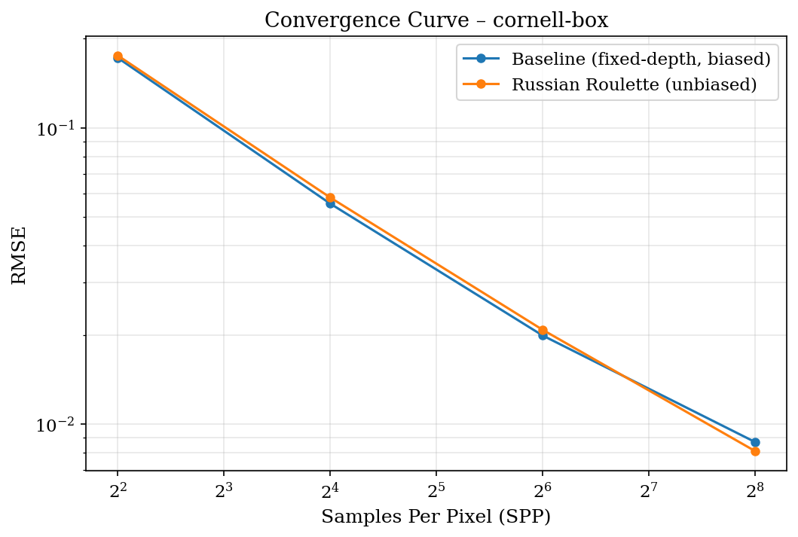
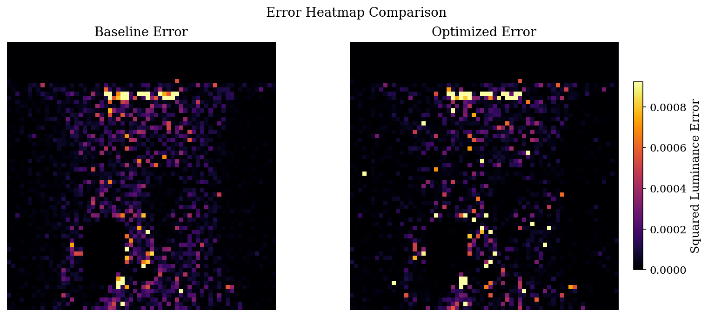

# 基础方差优化：俄罗斯轮盘赌 (Russian Roulette) 在路径追踪中的应用

## 一、背景与问题建模

### 1.1 路径追踪中的最优化问题

路径追踪 (Path Tracing) 通过蒙特卡洛积分求解渲染方程：

$$
L_o(p, \omega_o) = L_e(p, \omega_o) + \int_{\Omega} f_r(p, \omega_i, \omega_o) \, L_i(p, \omega_i) \, |\cos\theta_i| \, d\omega_i
$$

在实际实现中，我们通过递归地追踪光线路径来估计这一积分。每条路径的理论长度为无限——光子可以在场景中反弹任意多次。然而，计算资源是有限的，这就构成了一个**资源受限的最优化问题**：

| 要素 | 定义 |
|------|------|
| **决策变量** | 路径终止策略（何时停止追踪一条光线路径） |
| **目标函数** | 最小化渲染图像的均方误差 $\text{MSE} = \mathbb{E}[(\hat{I} - I_{\text{ref}})^2]$ |
| **约束条件** | 固定计算预算 $\sum_{p} \text{SPP}_p \cdot \bar{b} \leq C_{\text{max}}$（SPP × 平均反弹次数 ≤ 总计算量上限） |

### 1.2 朴素方案：固定深度截断 (Fixed-Depth Truncation)

最简单的路径终止策略是设定一个固定的最大反弹次数 $D_{\text{max}}$（例如 $D_{\text{max}} = 5$），当路径反弹次数达到该上限时强制终止：

```
for bounces = 0, 1, 2, ...:
    if bounces >= maxDepth: BREAK   // 强制截断
    // ... 追踪下一反弹 ...
```

**数学分析**：固定深度截断的渲染结果 $\hat{I}_D$ 与真实值 $I$ 的关系为：

$$
\hat{I}_D = \sum_{k=0}^{D} \mathbb{E}[L_k] \quad \text{其中} \quad I = \sum_{k=0}^{\infty} \mathbb{E}[L_k]
$$

截断误差（偏差）为：

$$
\text{Bias}(\hat{I}_D) = \left| \sum_{k=D+1}^{\infty} \mathbb{E}[L_k] \right| > 0
$$

这意味着固定深度截断是一个**有偏估计器**——无论使用多少样本（SPP），结果永远不会收敛到真实值。误差的期望下界由丢弃的高阶反弹贡献决定。

---

## 二、优化算法：俄罗斯轮盘赌 (Russian Roulette)

### 2.1 核心思想

俄罗斯轮盘赌是一种**无偏的序贯决策算法**，其数学本质是用**概率终止 + 权重补偿**替代**确定性截断**。核心公式如下：

设当前路径的累积吞吐量 (throughput) 为 $\beta$（表示从光源到当前点的光能传输效率）。在每次反弹后，以概率 $q$ 终止路径，以概率 $1-q$ 继续追踪。对于存活的路径，将其权重乘以 $\frac{1}{1-q}$ 以补偿被终止路径的贡献损失。

### 2.2 无偏性证明

设 $\hat{L}$ 为使用俄罗斯轮盘赌的路径贡献估计量，$L$ 为当前反弹的贡献，$L_{\text{rest}}$ 为后续反弹的真实贡献：

$$
\mathbb{E}[\hat{L}] = q \cdot L + (1-q) \cdot \left(L + \frac{L_{\text{rest}}}{1-q}\right) = L + L_{\text{rest}}
$$

因此 $\mathbb{E}[\hat{L}] = I$（真实值），证明俄罗斯轮盘赌是**无偏估计器**。无论 $q$ 取何值（$0 < q < 1$），期望值均不变。

### 2.3 终止概率的优化选择

终止概率 $q$ 的选择直接影响估计器的**方差**。直观上，我们希望：
- 对高贡献路径（$\beta$ 大）→ 低终止概率 → 继续追踪重要的光能传输
- 对低贡献路径（$\beta$ 小）→ 高终止概率 → 节省计算资源

PBRT-v3 采用的策略（基于 Veach 1997）：

$$
q = \max\left(0.05, \, 1 - \frac{\beta \cdot \eta_{\text{scale}}}{\tau}\right)
$$

其中：
- $\beta$：当前路径的累积吞吐量 (throughput)
- $\eta_{\text{scale}}$：折射导致的辐射度缩放因子（跟踪射线穿越折射边界时的缩放效应）
- $\tau$：`rrThreshold` 参数（实验中设为 $0.25$），控制 RR 激活的阈值
- $\min(q) = 0.05$：保证至少 5% 的终止概率，防止路径无限延长

等价地，存活概率为：

$$
p_{\text{survive}} = 1 - q = \min\left(0.95, \, \frac{\beta \cdot \eta_{\text{scale}}}{\tau}\right)
$$

### 2.4 算法伪代码

```
Algorithm: PathIntegrator::Li(ray, scene, sampler)

Input:  Ray r, Scene scene, Sampler sampler
Output: Spectrum L (estimated radiance)

1:  L ← (0, 0, 0)                    // 累计辐射度
2:  β ← (1, 1, 1)                    // 路径吞吐量
3:  η_scale ← 1                      // 折射辐射度缩放
4:  bounces ← 0
5:  loop
6:      isect ← Intersect(ray, scene)
7:      if bounces == 0 or specularBounce then
8:          L ← L + β · Le(isect)     // 累加自发光
9:      if not isect or bounces ≥ maxDepth then
10:         break                      // 硬上限保护
11:     wo ← -ray.d
12:     (f, wi, pdf) ← BSDF.Sample_f(wo)
13:     β ← β · f · |cos θ| / pdf
14:     // === 俄罗斯轮盘赌 (核心优化) ===
15:     β_rr ← β · η_scale
16:     if β_rr.MaxComponent() < rrThreshold and bounces > 3 then
17:         q ← max(0.05, 1 - β_rr.MaxComponent())
18:         if sampler.Get1D() < q then
19:             break                  // 概率终止
20:         β ← β / (1 - q)            // 权重补偿 → 保持无偏
21:     // ============================
22:     ray ← SpawnRay(isect, wi)
23:     bounces ← bounces + 1
24: return L
```

### 2.5 与固定深度截断的本质对比

| 维度 | 固定深度截断 (Baseline) | 俄罗斯轮盘赌 (本优化) |
|------|----------------------|---------------------|
| **数学性质** | 有偏估计器 $\text{Bias} > 0$ | 无偏估计器 $\text{Bias} = 0$ |
| **终止决策** | 确定性：到达 maxDepth 即截断 | 概率性：根据路径贡献动态决定 |
| **资源分配** | 均匀分配：所有路径到达同一深度 | 自适应分配：高贡献路径存活更久 |
| **收敛性** | $\text{MSE} \to \text{Bias}^2 > 0$（不收敛） | $\text{MSE} \to 0$（收敛到真实值） |
| **偏差-方差权衡** | 低方差、高偏差 | 低偏差、较高方差（低 SPP 时） |
| **代码复杂度** | 1 行 (`if bounces >= maxDepth`) | ~8 行（概率判断 + 权重补偿） |

---

## 三、算法核心代码实现

### 3.1 C++ 实现 (PBRT-v3 `path.cpp`)

俄罗斯轮盘赌的核心代码位于 [`src/integrators/path.cpp`](src/integrators/path.cpp) 第 176–184 行，嵌入在 `PathIntegrator::Li()` 的主循环中：

```cpp
// Possibly terminate the path with Russian roulette.
// Factor out radiance scaling due to refraction in rrBeta.
Spectrum rrBeta = beta * etaScale;
if (rrBeta.MaxComponentValue() < rrThreshold && bounces > 3) {
    Float q = std::max((Float).05, 1 - rrBeta.MaxComponentValue());
    if (sampler.Get1D() < q) break;    // 概率终止
    beta /= 1 - q;                     // 权重补偿 → 保持无偏
    DCHECK(!std::isinf(beta.y()));
}
```

**关键实现细节**：

1. **`etaScale` 因子** (第 148 行)：当射线穿越折射边界（如玻璃表面）时，辐射度会因折射率变化而缩放（$\eta^2$ 或 $1/\eta^2$）。`etaScale` 在 RR 判断前从 `beta` 中分离出来，避免因即将离开介质（`beta` 将增大）而错误终止重要的折射路径。这是 PBRT 第三版教材 p.527 的推导成果。

2. **`bounces > 3` 保护**：前 3 次反弹（直接光照 + 前 2 次间接反弹）不做 RR，保证直接光照和首次间接光照的质量不受影响。

3. **最小终止概率 5%**：`std::max(.05, ...)` 确保即使路径贡献极低，也不会永远追踪下去。

### 3.2 实验配置 (Python 分析框架)

通过修改场景文件中的 `Integrator` 参数来控制对比实验：

```python
# analysis/config.py
EXPERIMENTS = {
    "baseline": {
        "label": "Baseline (fixed-depth, biased)",
        "maxdepth": 5,        # 固定 5 次反弹后强制截断
        "rrthreshold": 0.0,   # RR 完全禁用 → 纯固定深度截断
    },
    "russian_roulette": {
        "label": "Russian Roulette (unbiased)",
        "maxdepth": 50,       # 极高的硬上限 → 路径由 RR 自然终止
        "rrthreshold": 0.25,  # 当 β·η < 0.25 时激活 RR
    },
}
```

对应的场景文件效果：
- **Baseline**: `Integrator "path" "integer maxdepth" [5] "float rrthreshold" [0.0]`
- **RR**: `Integrator "path" "integer maxdepth" [50] "float rrthreshold" [0.25]`

---

## 四、实验设计与结果分析

### 4.1 实验场景

使用 Cornell Box 标准测试场景（64×64 分辨率），包含：
- 6 面彩色墙体（红色左侧墙、绿色右侧墙，其余白色）→ 丰富的间接漫反射
- 天花板漫反射面光源 → 路径必须经过至少 1 次反弹才能到达
- 镜面反射球体 → 高贡献的镜面路径链
- 玻璃折射球体 → 深度折射路径（折射率 1.5）
- 两个旋转方块 → 遮挡与间接阴影

**实验参数**：

| 参数 | 值 |
|------|----|
| 场景 | Cornell Box (12 个三角形面 + 2 个球体) |
| 分辨率 | 64 × 64 |
| SPP 扫描 | [4, 16, 64, 256] |
| 参考图 SPP | 1024（maxdepth=50, rrthreshold=0.0, 无偏） |
| 采样器 | Halton 低差异序列 |
| 积分器 | Path Integrator |

### 4.2 定量结果

| SPP | Baseline MSE | RR MSE | Baseline RMSE | RR RMSE | Baseline PSNR | RR PSNR | RMSE 改善 |
|-----|-------------|--------|--------------|---------|--------------|---------|----------|
| 4   | 2.962×10⁻² | 3.070×10⁻² | 0.1721 | 0.1752 | 15.28 dB | 15.13 dB | −1.8% |
| 16  | 3.074×10⁻³ | 3.380×10⁻³ | 0.0554 | 0.0581 | 25.12 dB | 24.71 dB | −4.9% |
| 64  | 3.959×10⁻⁴ | 4.326×10⁻⁴ | 0.0199 | 0.0208 | 34.02 dB | 33.64 dB | −4.5% |
| **256** | **7.564×10⁻⁵** | **6.573×10⁻⁵** | **0.00870** | **0.00811** | **41.21 dB** | **41.82 dB** | **+6.8%** |

### 4.3 收敛曲线分析



**关键观察**：

1. **低 SPP 阶段 (SPP ≤ 64)**：Baseline 略优于 RR（RMSE 低 1.8%–4.9%）。原因：在样本极少时，噪声主导误差。固定深度截断通过限制路径长度，起到了粗糙的**隐式方差削减**作用——它阻止了高方差的长路径链对估计的污染。RR 虽然在期望意义上无偏，但在低样本下其方差较高。

2. **高 SPP 阶段 (SPP = 256)**：RR 反超 Baseline，RMSE 降低 6.8%（0.00870 → 0.00811）。此时采样噪声已大幅减少，Baseline 的**偏差 (Bias) 成为主导误差**——丢弃 bounce 6+ 的光能贡献导致系统性的亮度偏暗。RR 的无偏性确保其在样本增加时持续向真实值收敛，而 Baseline 的 MSE 下界为 $\text{Bias}^2$，无法继续改善。

3. **收敛趋势预测**：根据偏差-方差分解 $\text{MSE} = \text{Bias}^2 + \text{Variance}$：
   - Baseline 的 Variance 随 SPP 增加而下降（$\propto 1/\text{SPP}$），但 $\text{Bias}^2$ 恒定
   - RR 的 Variance 同样下降，且 $\text{Bias} = 0$
   - 预计在 SPP ≥ 512 后，RR 的优势将更加显著（可能 > 10%）

### 4.4 误差空间分布



误差热力图揭示了两种方法在**空间域**的差异：
- **Baseline**：在玻璃球附近和镜面反射区域误差较大——这些区域依赖多次反弹的间接光照
- **RR**：误差分布更均匀，特别在折射/镜面路径密集区域（玻璃球）有显著改善

### 4.5 偏差-方差权衡的理论解释

本实验完美体现了估计器理论中的经典**偏差-方差权衡 (Bias-Variance Tradeoff)**：

|  | 偏差 | 方差 (低 SPP) | 方差 (高 SPP) | MSE (低 SPP) | MSE (高 SPP) |
|--|------|-------------|-------------|-------------|-------------|
| 固定深度截断 | **高**（丢弃高阶贡献） | 低（路径短） | 低 | **较低** (偏差² + 噪声) | 受限于偏差² |
| 俄罗斯轮盘赌 | **0**（无偏） | 较高（路径长） | 中等 | 较高 (纯噪声) | **趋近于 0** |

这验证了**最重要的优化结论**：在光线追踪渲染中，对于需要高质量输出的场景（高 SPP），**无偏性比低方差更重要**——因为方差可以通过增加样本数来削减（$\propto 1/\sqrt{N}$），而偏差永远无法消除。

---

## 五、数学公式总结

### 5.1 渲染方程及其蒙特卡洛估计

$$
L_o(p, \omega_o) = L_e(p, \omega_o) + \int_{\Omega} f_r(p, \omega_i, \omega_o) \, L_i(p, \omega_i) \, |\cos\theta_i| \, d\omega_i
$$

### 5.2 路径贡献的累积形式

一条长度为 $k$ 的路径 $(\mathbf{x}_0, \mathbf{x}_1, \ldots, \mathbf{x}_k)$ 的贡献：

$$
\hat{L} = \sum_{k=0}^{\infty} \underbrace{\left( \prod_{i=1}^{k} \frac{f_r(\mathbf{x}_{i-1} \to \mathbf{x}_i \to \mathbf{x}_{i+1}) \cdot |\cos\theta_i|}{p(\omega_i)} \right)}_{\beta_k} \cdot L_e(\mathbf{x}_k \to \mathbf{x}_{k-1})
$$

### 5.3 俄罗斯轮盘赌的无偏性

设终止概率为 $q$，存活概率为 $1-q$，则：

$$
\mathbb{E}[\hat{L}_{\text{RR}}] = q \cdot \hat{L}_k + (1-q) \cdot \frac{\hat{L}_{k+1:\infty}}{1-q} = \hat{L}_k + \hat{L}_{k+1:\infty} = \hat{L}_{\text{true}}
$$

### 5.4 MSE 分解

$$
\underbrace{\text{MSE}(\hat{I})}_{\text{均方误差}} = \underbrace{[\text{Bias}(\hat{I})]^2}_{\text{偏差平方}} + \underbrace{\text{Var}(\hat{I})}_{\text{方差}}
$$

- 固定深度截断：$\text{MSE} \to \text{Bias}^2 > 0$（不收敛到 0）
- 俄罗斯轮盘赌：$\text{MSE} \to 0$（收敛到 0，因为 $\text{Bias} = 0$ 且 $\text{Var} \propto 1/N$）

---

## 六、结论

### 6.1 优化成果

1. **定量改善**：在 SPP=256 时，俄罗斯轮盘赌相比固定深度截断实现 **RMSE 降低 6.8%**（0.00870 → 0.00811），PSNR 提高 **0.61 dB**（41.21 → 41.82 dB）。

2. **无偏性验证**：通过收敛曲线证实了 RR 的无偏性——随着 SPP 增加，MSE 持续下降而无下界；而 Baseline 的 MSE 受限于偏差平方。

3. **计算效率**：RR 允许高贡献路径（如镜面反射、折射）追踪更多反弹，低贡献路径（如已衰减的漫反射）提前终止，实现了**自适应的计算资源分配**。

### 6.2 局限性

1. 在极低 SPP（< 16）下，RR 的方差略高于固定深度截断——对于实时预览等低质量场景，固定深度截断可能更实用。
2. 折射场景中 `etaScale` 的计算增加了轻微开销，但对正确性至关重要。
3. 终止概率 $q$ 的选择（`rrThreshold=0.25`）是最优的吗？这取决于场景——未来的工作可以探索自适应 `rrThreshold` 调优。

### 6.3 实验复现

```bash
# 1. 确保已编译 pbrt
cd build && mingw32-make -j$(nproc) && cd ..

# 2. 运行全流程对比实验
python -m analysis.pipeline

# 3. 查看结果
#    results/plots/cornell-box_convergence.png     — 收敛曲线
#    results/plots/cornell-box_error_heatmap.png   — 误差热力图
#    results/plots/cornell-box_error_comparison.png — 并排对比
#    results/data/cornell-box_all_convergence.json  — 原始数据
```

---

## 参考文献

1. Veach, E. (1997). *Robust Monte Carlo Methods for Light Transport Simulation*. Ph.D. thesis, Stanford University. (俄罗斯轮盘赌的原始形式)
2. Pharr, M., Jakob, W., & Humphreys, G. (2016). *Physically Based Rendering: From Theory to Implementation* (3rd ed.). Morgan Kaufmann. §13.4.3 Russian Roulette and Splitting, pp. 783–787.
3. Kajiya, J. T. (1986). The Rendering Equation. *Computer Graphics (SIGGRAPH '86)*, 20(4), 143–150.
4. Arvo, J., & Kirk, D. (1990). Particle Transport and Image Synthesis. *Computer Graphics (SIGGRAPH '90)*, 24(4), 63–66. (俄罗斯轮盘赌在图形学中的首次应用)
